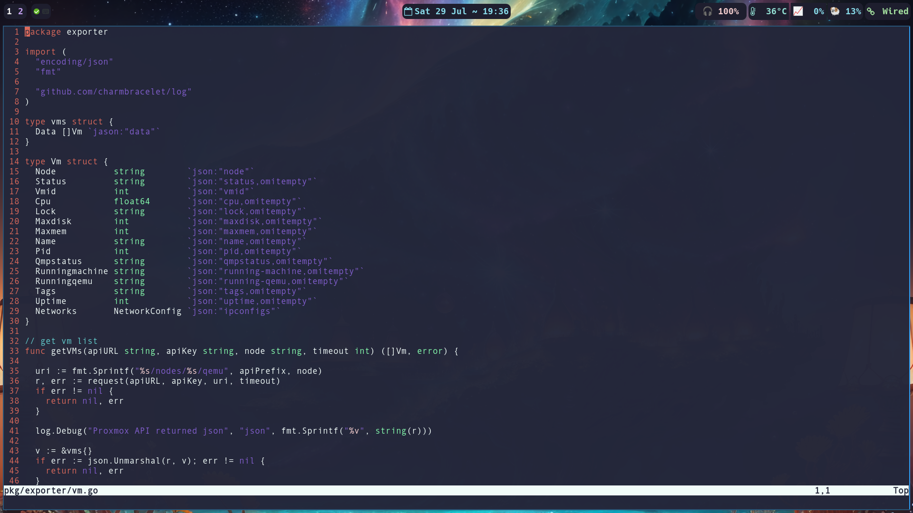

# sway-dotfiles

## Preview
<p float="left">
  
   
   
   
</p>

## Install

Clone the repo and run the install-files bash script

```bash
git clone https://github.com/PeeK1e/sway-dotfiles.git
cd sway-dotfiles
bash install-files.sh
```

To override QT settings place something like this into your `.zprofile` (when using ZSH else use the .profile file of your shell)
```bash
# replace by your favorite color scheme
export GTK_THEME='Catppuccin-Mocha-Standard-Mauve-dark'
export QT_STYLE_OVERRIDE='gtk2'
export QT_QPA_PLATFORMTHEME='wayland'
```

## Dependencies

Following Arch / AUR packages were used

#### Colors
* catppuccin-gtk-theme-mocha
#### Emojis
* noto-fonts-emoji
* otf-openmoji
#### Sway Building Blocks
* sway (ofc)
* rofi-lbonn-wayland
* rofi-emoji
* waybar
* mako
#### Screenshots
* grim
* slurp
* swappy
#### Other
* neovim
* foot
#### Fonts
* ttf-hack-nerd

```bash
paru -S mako \
          waybar \
          sway \
          otf-openmoji \
          noto-fonts-emoji \
          catppuccin-gtk-theme-mocha \
          grim slurp \
          swappy neovim \
          foot ttf-hack-nerd\
          rofi-emoji \
          rofi-lbonn-wayland
```

## Background

The Background image was AI generated, unfortunately I forgot the prompt and which model I used.

## Color Theme

It is mainly based on Catppucin mocha. Use something like lxappearance to set the GTK color theme.
